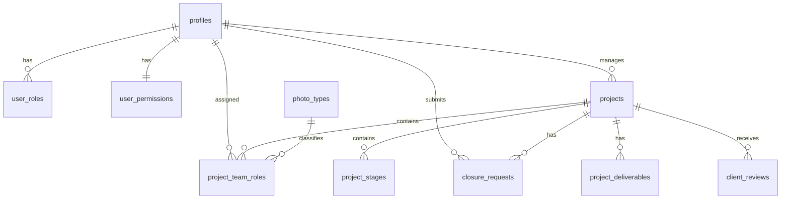

# Supabase Schema Draft — Sprint 8

**Status:** DRAFT for review. **Not a migration.** Do not apply this sprint. DDL below is illustrative reference to align the team; it will be turned into real migrations in a later, explicitly-approved sprint.

**Excluded by guardrail (no tables/columns for any of these):** finance, payments, payment requests, finance reports, Rekaz, notifications, FCM, push, reminders.

---

## 1. Enums

Mirror the Dart enums (keys match `RoleType.key`, `ProjectType.key`, `ProjectStatus.key`, stage/closure statuses).

```sql
-- DRAFT
create type role_type as enum (
  'admin','manager','photographer','designer',
  'wedding_admin','attendance','personal_photo',
  'marketing',            -- reserved/proposed (not in app RoleType yet)
  'finance','wedding_finance'  -- inert labels only: NO finance data/logic
);

create type project_type   as enum ('field','social','wedding');
create type project_status as enum (
  'active','in_progress','pending_closure','completed','delivered','approved','rejected'
);
create type stage_status   as enum ('pending','current','done');
create type closure_status as enum ('pending','approved','rejected');
```

> `finance` / `wedding_finance` are kept only so the role set matches the app; they receive no tables, data, or policies.

---

## 2. Tables

### 2.1 `profiles` (staff identity)
PK links 1:1 to `auth.users`.

| Column | Type | Notes |
|---|---|---|
| `id` | `uuid` PK → `auth.users(id)` | |
| `username` | `text` unique, not null | app logs in by username |
| `full_name` | `text` not null | |
| `email` | `text` null | optional / synthetic |
| `avatar_initials` | `text` null | computed client-side today |
| `default_role` | `role_type` not null | routing role |
| `active` | `boolean` not null default true | disabled = cannot log in |
| `created_at` / `updated_at` | `timestamptz` default now() | |
| `deleted_at` | `timestamptz` null | soft delete (recommended) |

### 2.2 `user_roles` (multi-role join)
A user may hold several roles; `default_role` above is one of them.

| Column | Type | Notes |
|---|---|---|
| `user_id` | `uuid` → `profiles(id)` | |
| `role` | `role_type` | |
| PK | (`user_id`,`role`) | |

### 2.3 `user_permissions` (feature flags + photo types)
Mirrors `PermissionModel` / `FeaturePermissions`.

| Column | Type | Notes |
|---|---|---|
| `user_id` | `uuid` PK → `profiles(id)` | 1:1 |
| `features` | `jsonb` not null default '{}' | mirrors `AppFeature` booleans; **exclude `can_manage_finance`** |
| `photo_types` | `text[]` not null default '{}' | e.g. `{'مصور فوتوغرافي'}` |
| `updated_at` | `timestamptz` default now() | |

> `features` keys (in scope): `can_add_project`, `can_edit_project`, `can_assign_photographers`, `can_request_photographer`, `can_request_design`, `can_update_stages`, `can_request_closure`, `can_approve_closure`, `can_manage_users`, `can_manage_permissions`, `can_view_reports`, `can_manage_attendance`, `can_manage_wedding_projects`.
> **Excluded:** `can_manage_finance` (guardrail).

### 2.4 `photo_types` (lookup — optional, recommended)
| Column | Type | Notes |
|---|---|---|
| `id` | `uuid` PK | |
| `name_ar` | `text` unique | e.g. «مصور فوتوغرافي», «مصور فيديو», «انستقرام», «تصميم» |
| `active` | `boolean` default true | |

### 2.5 `projects`
Mirrors `ProjectModel`.

| Column | Type | Notes |
|---|---|---|
| `id` | `uuid` PK | |
| `serial` | `text` unique not null | `PREFIX-XXXX-XX` (FLD/SOC/WED) |
| `name` | `text` not null | |
| `client_name` | `text` not null | |
| `manager_id` | `uuid` → `profiles(id)` | project owner |
| `type` | `project_type` not null | |
| `status` | `project_status` not null default 'active' | |
| `start_date` | `date` not null | |
| `end_date` | `date` not null | delivery date |
| `notes` | `text` null | |
| `created_at` / `updated_at` | `timestamptz` default now() | |
| `deleted_at` | `timestamptz` null | soft delete |

Indexes: `serial` (unique), `manager_id`, `status`, `type`, `(start_date,end_date)`.
Check: `end_date >= start_date` (app rule).

> `manager_name` in the model is **denormalized display** — derive from `profiles` via a view/join instead of storing.

### 2.6 `project_team_roles`
Mirrors `ProjectTeamRole`. One row per (person, photo type) on a project.

| Column | Type | Notes |
|---|---|---|
| `id` | `uuid` PK | |
| `project_id` | `uuid` → `projects(id)` on delete cascade | |
| `type` | `text` (or → `photo_types`) | photo type |
| `person_name` | `text` not null | supports external people |
| `user_id` | `uuid` null → `profiles(id)` | null = external |
| `value` | `numeric default 0` | **assignment metadata only — not finance** |
| `date` | `date` null | assignment/shoot date (availability) |

Indexes: `project_id`, `user_id`, `date`.

### 2.7 `project_stages`
Mirrors `ProjectStageModel`.

| Column | Type | Notes |
|---|---|---|
| `id` | `uuid` PK | |
| `project_id` | `uuid` → `projects(id)` on delete cascade | |
| `title` | `text` not null | Arabic stage title |
| `order` | `int` not null | 1-based |
| `status` | `stage_status` not null default 'pending' | |
| `notes` | `text` null | |
| `updated_by` | `uuid` null → `profiles(id)` | who advanced it |
| `updated_at` | `timestamptz` null | |

Constraint: unique (`project_id`,`order`).

### 2.8 `closure_requests`
Mirrors `ClosureRequestModel`.

| Column | Type | Notes |
|---|---|---|
| `id` | `uuid` PK | |
| `project_id` | `uuid` → `projects(id)` on delete cascade | |
| `submitted_by` | `uuid` → `profiles(id)` | photographer |
| `created_at` | `timestamptz` default now() | |
| `delivery_link` | `text` null | URL |
| `report_file_url` | `text` null | URL/text today (Storage later) |
| `notes` | `text` null | |
| `status` | `closure_status` not null default 'pending' | |
| `reject_reason` | `text` null | |
| `reviewed_at` | `timestamptz` null | |

Partial unique index: **at most one `pending` per project** → `create unique index on closure_requests(project_id) where status='pending';`

> `project_name` / `submitted_by_name` in the model are **denormalized display** — join to `projects` / `profiles`.

### 2.9 `project_deliverables` (approved client links)
Backs `ClientTrackingModel.approvedLinks` (`DeliveryLink{label,url}`).

| Column | Type | Notes |
|---|---|---|
| `id` | `uuid` PK | |
| `project_id` | `uuid` → `projects(id)` on delete cascade | |
| `label` | `text` not null | e.g. deliverable/role |
| `url` | `text` not null | |
| `approved` | `boolean` not null default false | only approved links are public |
| `created_at` | `timestamptz` default now() | |

Index: `project_id`, and `(project_id) where approved`.

### 2.10 `client_reviews`
Backs `TrackingRepository.submitReview` + `ClientTrackingModel.rating/message`.

| Column | Type | Notes |
|---|---|---|
| `id` | `uuid` PK | |
| `project_id` | `uuid` → `projects(id)` on delete cascade | |
| `rating` | `int` check (rating between 1 and 5) | |
| `message` | `text` null | |
| `created_at` | `timestamptz` default now() | |

> Client identity is the **serial** (no client accounts). Reviews are written via the tracking RPC, resolved serial → project.

---

## 3. Relationships (ERD)



---

## 4. Model → column mapping (fidelity check)

| Dart model | Field | Table.column |
|---|---|---|
| `UserModel` | id / fullName / username / email / active / defaultRole | `profiles.*` |
| `UserModel` | roles | `user_roles.role` (rows) |
| `UserModel` | permissions | `user_permissions.features` (jsonb) |
| `UserModel` | photoTypes | `user_permissions.photo_types` |
| `ProjectModel` | id/serial/name/clientName/managerId/type/status/startDate/endDate/notes | `projects.*` |
| `ProjectModel` | managerName | derived (join `profiles`) |
| `ProjectModel` | teamRoles | `project_team_roles` (rows) |
| `ProjectModel` | stages | `project_stages` (rows) |
| `ProjectTeamRole` | type/personName/userId/value/date | `project_team_roles.*` |
| `ProjectStageModel` | title/order/status/notes/updatedBy/updatedAt | `project_stages.*` |
| `ClosureRequestModel` | projectId/submittedBy/createdAt/deliveryLink/reportFileUrl/notes/status/rejectReason/reviewedAt | `closure_requests.*` |
| `ClosureRequestModel` | projectName/submittedByName | derived (join) |
| `DeliveryLink` | label/url | `project_deliverables.*` (approved) |
| `ClientTrackingModel` | rating/message | `client_reviews.*` |
| `ProjectSerial` | format `PREFIX-XXXX-XX` | `projects.serial` (unique) |

---

## 5. Conventions

- **UUID PKs** everywhere (app currently uses string ids like `p-1`; migration maps/reseeds — see migration plan).
- **`timestamptz`** for time; **`date`** for shoot/delivery dates (matches date-only availability logic).
- **Soft delete** (`deleted_at`) on `profiles` and `projects`; hard delete only for child rows via cascade.
- **RLS enabled on every table** (default deny) — see `SUPABASE_RLS_PLAN.md`.
- **Denormalized display fields** (`manager_name`, `project_name`, `submitted_by_name`) are **not stored** — provide read **views** (e.g. `v_projects`, `v_closure_requests`) that join names, so repository reads stay one-shot.

---

## 6. Explicitly NOT created (guardrail)

No `finance_*`, `payments`, `payment_requests`, `transfers`, `finance_reports`, `rekaz_*`, `notifications`, `notification_settings`, `reminders`, `devices`, or `fcm_tokens` tables — now or in any future sprint, unless the owner explicitly reverses the exclusion.
