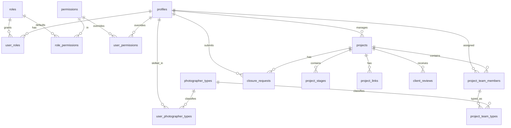

# Supabase Schema Draft — Sprint 8 (Decisions Frozen)

**Status:** DRAFT for review, aligned to the **frozen decisions** in `SUPABASE_CORE_PLAN.md` §1. **Not a migration.** DDL is illustrative reference only; real migrations happen in a later approved apply-sprint.

**Excluded (no tables/columns):** finance, payments, payment requests, finance reports, Rekaz, notifications, FCM, push, reminders.

**Frozen-decision anchors:** roles as lookup (D1) · username + internal auth email (D2) · normalized photographer types (D3) · `project_links` with approval + client visibility (D4) · normalized permissions (D5) · soft-delete on profiles/projects/project_links (D6).

---

## 1. Enums (kept as Postgres enums — stable domains)

```sql
-- DRAFT. Roles are NOT an enum (see D1 → roles lookup table).
create type project_type   as enum ('field','social','wedding');
create type project_status as enum (
  'active','in_progress','pending_closure','completed','delivered','approved','rejected'
);
create type stage_status   as enum ('pending','current','done');
create type closure_status as enum ('pending','approved','rejected');
```

---

## 2. Identity, roles & permissions

### 2.1 `roles` (lookup — D1)
| Column | Type | Notes |
|---|---|---|
| `id` | `uuid` PK | |
| `code` | `text` unique not null | `admin`,`manager`,`photographer`,`marketing`,`designer`,`wedding_admin`,`attendance`,`personal_photo`,`finance`*,`wedding_finance`* |
| `name_ar` | `text` not null | display label |
| `is_active` | `boolean` default true | |

\* `finance`/`wedding_finance` are **inert labels** — no finance data/logic (guardrail).

### 2.2 `profiles` (staff identity — D2, D6)
PK links 1:1 to `auth.users`.

| Column | Type | Notes |
|---|---|---|
| `id` | `uuid` PK → `auth.users(id)` | |
| `username` | `text` unique not null | **normalized: lowercase, trimmed, validated** |
| `full_name` | `text` not null | |
| `default_role_id` | `uuid` → `roles(id)` not null | routing role |
| `avatar_initials` | `text` null | computed client-side today |
| `is_active` | `boolean` not null default true | disabled = cannot log in |
| `created_at` / `updated_at` | `timestamptz` default now() | |
| `deleted_at` | `timestamptz` null | soft delete (D6) |
| `deleted_by` | `uuid` null → `profiles(id)` | who deactivated |

> The **internal auth email** (`normalized_username@users.sumou.internal`) lives on `auth.users.email`. It is an implementation detail — **never displayed**; the app only shows `username`. `username` unique constraint should be enforced case-insensitively (store normalized).

### 2.3 `user_roles` (multi-role join — D1)
| Column | Type | Notes |
|---|---|---|
| `user_id` | `uuid` → `profiles(id)` | |
| `role_id` | `uuid` → `roles(id)` | |
| PK | (`user_id`,`role_id`) | `default_role_id` must be among these |

### 2.4 `permissions` (lookup — D5)
| Column | Type | Notes |
|---|---|---|
| `id` | `uuid` PK | |
| `code` | `text` unique not null | mirrors `AppFeature` (**excluding `can_manage_finance`**) |
| `name_ar` | `text` | |

> In-scope codes: `can_add_project`, `can_edit_project`, `can_assign_photographers`, `can_request_photographer`, `can_request_design`, `can_update_stages`, `can_request_closure`, `can_approve_closure`, `can_manage_users`, `can_manage_permissions`, `can_view_reports`, `can_manage_attendance`, `can_manage_wedding_projects`. **Excluded:** `can_manage_finance`.

### 2.5 `role_permissions` (role defaults — D5)
| Column | Type | Notes |
|---|---|---|
| `role_id` | `uuid` → `roles(id)` | |
| `permission_id` | `uuid` → `permissions(id)` | |
| `granted` | `boolean` not null default true | default for the role |
| PK | (`role_id`,`permission_id`) | |

### 2.6 `user_permissions` (user overrides — D5)
| Column | Type | Notes |
|---|---|---|
| `user_id` | `uuid` → `profiles(id)` | |
| `permission_id` | `uuid` → `permissions(id)` | |
| `granted` | `boolean` not null | explicit override (true/false) |
| PK | (`user_id`,`permission_id`) | absence = fall back to role default |

**Resolution (server-enforced):** `effective(user, perm) = user_permissions.granted` if a row exists, **else** `OR` of `role_permissions.granted` across the user's roles (default `false`).

---

## 3. Photographer types (D3)

### 3.1 `photographer_types` (lookup)
| Column | Type | Notes |
|---|---|---|
| `id` | `uuid` PK | |
| `code` | `text` unique | stable key |
| `name_ar` | `text` unique | «مصور فوتوغرافي», «مصور فيديو», «انستقرام», «تصميم» |
| `is_active` | `boolean` default true | |

### 3.2 `user_photographer_types` (a user's skills — many-to-many)
| Column | Type | Notes |
|---|---|---|
| `user_id` | `uuid` → `profiles(id)` | |
| `photographer_type_id` | `uuid` → `photographer_types(id)` | |
| PK | (`user_id`,`photographer_type_id`) | |

---

## 4. Projects & work

### 4.1 `projects` (D6)
| Column | Type | Notes |
|---|---|---|
| `id` | `uuid` PK | |
| `serial` | `text` unique not null | `PREFIX-XXXX-XX` (FLD/SOC/WED) |
| `name` | `text` not null | |
| `client_name` | `text` not null | |
| `manager_id` | `uuid` → `profiles(id)` | owner |
| `type` | `project_type` not null | |
| `status` | `project_status` not null default 'active' | |
| `start_date` | `date` not null | |
| `end_date` | `date` not null | check `end_date >= start_date` |
| `notes` | `text` null | |
| `is_active` | `boolean` not null default true | |
| `created_at` / `updated_at` | `timestamptz` default now() | |
| `deleted_at` / `deleted_by` | `timestamptz` / `uuid` null | soft delete (D6) |

Indexes: `serial` unique, `manager_id`, `status`, `type`, `(start_date,end_date)`, partial `where deleted_at is null`.
`manager_name` (model display field) is **derived** via a join/view, not stored.

### 4.2 `project_team_members` (one row per person per project — D3)
_(base team row; renamed from the earlier `project_team_roles` — types now normalized)_

| Column | Type | Notes |
|---|---|---|
| `id` | `uuid` PK | |
| `project_id` | `uuid` → `projects(id)` on delete cascade | |
| `user_id` | `uuid` null → `profiles(id)` | null = external person |
| `person_name` | `text` not null | |
| `value` | `numeric default 0` | **assignment metadata only — not finance** |
| `date` | `date` null | assignment/shoot date (availability) |

Indexes: `project_id`, `user_id`, `date`. Unique (`project_id`,`user_id`) where `user_id is not null` (no duplicate photographer per project).

### 4.3 `project_team_types` (types per team member — D3)
| Column | Type | Notes |
|---|---|---|
| `id` | `uuid` PK | |
| `team_member_id` | `uuid` → `project_team_members(id)` on delete cascade | |
| `photographer_type_id` | `uuid` → `photographer_types(id)` | |
| PK-ish | unique (`team_member_id`,`photographer_type_id`) | multiple types per member |

### 4.4 `project_stages` (retained history — no soft delete)
| Column | Type | Notes |
|---|---|---|
| `id` | `uuid` PK | |
| `project_id` | `uuid` → `projects(id)` on delete cascade | |
| `title` | `text` not null | |
| `order` | `int` not null | unique (`project_id`,`order`) |
| `status` | `stage_status` not null default 'pending' | |
| `notes` | `text` null | |
| `updated_by` | `uuid` null → `profiles(id)` | |
| `updated_at` | `timestamptz` null | |

### 4.5 `closure_requests` (retained history — no soft delete)
| Column | Type | Notes |
|---|---|---|
| `id` | `uuid` PK | |
| `project_id` | `uuid` → `projects(id)` on delete cascade | |
| `submitted_by` | `uuid` → `profiles(id)` | photographer |
| `created_at` | `timestamptz` default now() | |
| `delivery_link` | `text` null | URL |
| `report_file_url` | `text` null | URL/text (Storage deferred, D4) |
| `notes` | `text` null | |
| `status` | `closure_status` not null default 'pending' | |
| `reject_reason` | `text` null | |
| `reviewed_at` | `timestamptz` null | |

Partial unique: **one pending per project** → `unique (project_id) where status='pending'`.
`project_name` / `submitted_by_name` (model display) are **derived** via join/view.

### 4.6 `project_links` (delivery links — D4, D6)
_(replaces the earlier `project_deliverables`)_

| Column | Type | Notes |
|---|---|---|
| `id` | `uuid` PK | |
| `project_id` | `uuid` → `projects(id)` on delete cascade | |
| `label` | `text` not null | |
| `url` | `text` not null | URL only (no Storage yet) |
| `is_approved` | `boolean` not null default false | |
| `is_client_visible` | `boolean` not null default false | |
| `is_active` | `boolean` not null default true | soft delete (D6) |
| `created_at` | `timestamptz` default now() | |
| `deleted_at` / `deleted_by` | `timestamptz` / `uuid` null | |

Public exposure requires **`is_approved AND is_client_visible AND is_active AND deleted_at is null`**. Index: `(project_id) where is_approved and is_client_visible`.

### 4.7 `client_reviews` (retained history)
| Column | Type | Notes |
|---|---|---|
| `id` | `uuid` PK | |
| `project_id` | `uuid` → `projects(id)` on delete cascade | |
| `rating` | `int` check (1..5) | |
| `message` | `text` null | |
| `created_at` | `timestamptz` default now() | |

### 4.8 `audit_logs` (reserved — retained history, D6)
Optional but recommended for operational history (who did what). Retained, never deleted. Granularity finalized at apply time.
| Column | Type | Notes |
|---|---|---|
| `id` | `uuid` PK | |
| `actor_id` | `uuid` → `profiles(id)` | |
| `action` | `text` | e.g. `project.create`, `closure.approve`, `user.deactivate` |
| `entity` / `entity_id` | `text` / `uuid` | target |
| `meta` | `jsonb` | small context (no finance/PII beyond need) |
| `created_at` | `timestamptz` default now() | |

---

## 5. Relationships (ERD)



---

## 6. Model → column mapping (fidelity)

| Dart model | Field | Table.column |
|---|---|---|
| `UserModel` | id/fullName/username/active/defaultRole | `profiles.*` (+`default_role_id`→`roles`) |
| `UserModel` | roles | `user_roles` → `roles.code` |
| `UserModel` | permissions | resolved: `user_permissions` over `role_permissions` (D5) |
| `UserModel` | photoTypes | `user_photographer_types` → `photographer_types` |
| `ProjectModel` | id/serial/name/clientName/managerId/type/status/startDate/endDate/notes | `projects.*` |
| `ProjectModel` | managerName | derived (join `profiles`) |
| `ProjectModel` | teamRoles | `project_team_members` + `project_team_types` (D3) |
| `ProjectTeamRole` | personName/userId/value/date | `project_team_members.*` |
| `ProjectTeamRole` | type | `project_team_types` (row per type) |
| `ProjectStageModel` | title/order/status/notes/updatedBy/updatedAt | `project_stages.*` |
| `ClosureRequestModel` | projectId/submittedBy/createdAt/deliveryLink/reportFileUrl/notes/status/rejectReason/reviewedAt | `closure_requests.*` |
| `ClosureRequestModel` | projectName/submittedByName | derived (join) |
| `DeliveryLink` | label/url | `project_links.*` (approved + client-visible) |
| `ClientTrackingModel` | rating/message | `client_reviews.*` |

> **App impedance note (D3):** the app currently models one `ProjectTeamRole` per (person, type). The Supabase read implementation **aggregates** `project_team_members` + `project_team_types` back into that shape (one `ProjectTeamRole` per type, sharing person/fee/date), so the Flutter models don't change.

---

## 7. Conventions

- **UUID PKs** everywhere (app string ids like `p-1` are reseeded — see migration plan).
- **`timestamptz`** for time, **`date`** for shoot/delivery dates (matches date-only availability).
- **Soft delete** (`is_active` + `deleted_at` + `deleted_by`) on `profiles`, `projects`, `project_links` (D6). Stages, closures, reviews, audit logs are retained (status changes, never deleted).
- **RLS enabled on every table**, default deny (`SUPABASE_RLS_PLAN.md`).
- **Read views** (`v_projects`, `v_closure_requests`, `v_team`) join display names and pre-filter soft-deleted rows, so repository reads stay one-shot.

---

## 8. Explicitly NOT created (guardrail)

No `finance_*`, `payments`, `payment_requests`, `transfers`, `finance_reports`, `rekaz_*`, `notifications`, `notification_settings`, `reminders`, `devices`, or `fcm_tokens` — now or in any future sprint, unless the owner explicitly reverses the exclusion.

---

## 9. Step 2 implementation notes (identity & access)

Migration `supabase/migrations/20260714120000_identity_and_access.sql` implements
§2 (identity/roles/permissions) + `audit_logs`. Details decided at implementation
time (consistent with, and refining, this draft):

- **Seeded `name_ar`:** roles use `RoleType.nameAr`; permissions use
  `featureLabelAr` (Flutter). Seeded via idempotent `on conflict` upserts.
- **`marketing` name_ar = «تسويق»** — provisional: the Flutter `RoleType` has no
  `marketing` value yet, so it has no canonical Arabic label. Update when the
  Flutter role is added.
- **`client_tracking` is NOT a staff role** — it exists in Flutter `RoleType` but
  public tracking is anonymous (no profile), so it is not seeded into `roles`.
- **`finance` / `wedding_finance` roles carry NO permission defaults** — inert
  labels only (guardrail); their `FeaturePermissions.defaultsFor` finance grants
  are dropped.
- **Default-role invariant** (`profiles.default_role_id` must be a role the user
  holds) is enforced by a **composite `DEFERRABLE INITIALLY DEFERRED` FK**
  `profiles(id, default_role_id) → user_roles(user_id, role_id)`, so a profile
  and its default `user_roles` row are inserted in one transaction.
- **Finance exclusion is enforced in-DB** via `permissions_no_finance_chk`
  (`code <> 'can_manage_finance'`), so the excluded permission can never be added.
- **Normalized username** enforced by check `^[a-z0-9._-]{2,50}$` (lowercase,
  trimmed, no spaces, non-blank).
- **`updated_at`** maintained by a generic `public.set_updated_at()` trigger
  (only `profiles` has `updated_at` in this domain).
- **RLS enabled, no policies** on all 7 tables → access denied until Step 6.
